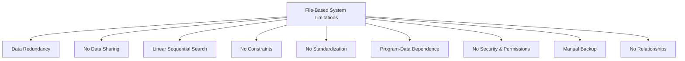

# Database Systems: From File-Based to Modern Approaches

## Introduction
This document provides an overview of database systems, starting with file-based systems and their limitations, and introducing the concept of modern database management systems.

## File-Based Systems

File-based systems store data in simple text files. There are two main formats:

1. **Delimited Files**: Values are separated by a delimiter (e.g., comma).
2. **Fixed-Width Files**: Values are separated by a fixed number of spaces.

### Example: Delimited File (employees.txt)
```
1,Ahmed,30,100
2,Omar,22,200
3,Aya,26,300
1,Ahmed,30,100
```

### Example: Fixed-Width File (departments.txt)
```
100    Sales
200    Hr
300    Sales
```

## Limitations of File-Based Systems



1. **Data Redundancy**: Duplication of data leads to inconsistencies.
2. **No Data Sharing**: Difficult for multiple users to access data simultaneously.
3. **Linear Sequential Search**: Inefficient for large datasets.
4. **No Constraints**: Data integrity is not enforced.
5. **No Standardization**: Lack of uniform data format across files.
6. **Program-Data Dependence**: Changes in data structure require program modifications.
7. **No Security & Permissions**: Lack of access control.
8. **Manual Backup**: No automated backup processes.
9. **No Relationships**: Cannot easily represent connections between different data entities.

## Modern Database Systems

Modern database systems address these limitations by introducing:

1. **Metadata**: Information about the data itself, such as:
   - Database names
   - Table names
   - Column names and types

2. **Automated Backups**: Scheduled jobs and tasks for data protection.

3. **Relationships**: Ability to represent and manage connections between different data entities.

4. **Security**: Robust access control and permissions management.

5. **Data Integrity**: Constraints and rules to maintain data accuracy.

6. **Efficient Querying**: Advanced search and retrieval mechanisms.

7. **Data Sharing**: Concurrent access for multiple users.

8. **Standardization**: Consistent data formats and structures.

## Conclusion

While file-based systems were a starting point for data management, modern database systems offer significant improvements in terms of efficiency, security, and data integrity. Understanding these concepts is crucial for effective data management in today's digital landscape.
