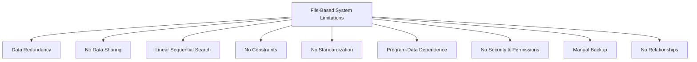
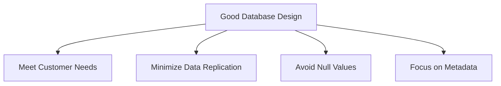
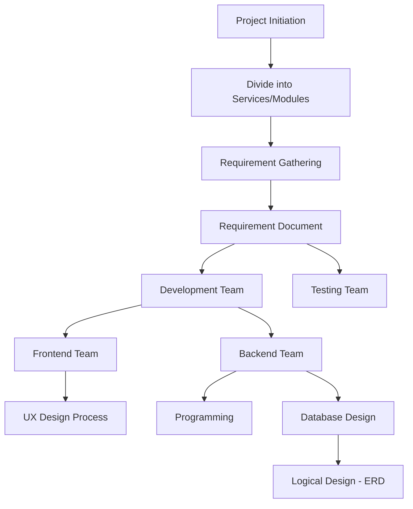
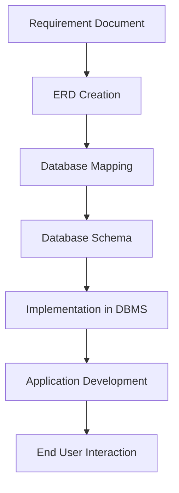
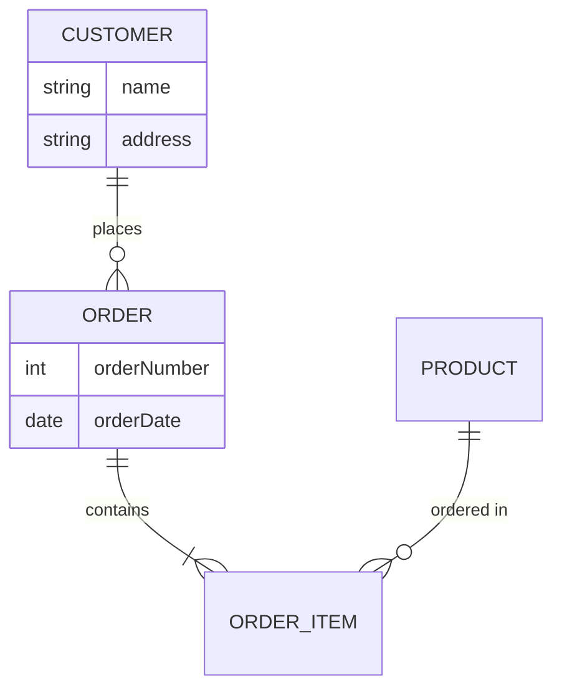

# Database Systems: From File-Based to Modern Approaches

## Introduction
This document provides an overview of database systems, starting with file-based systems and their limitations, and introducing the concept of modern database management systems.

## File-Based Systems

File-based systems store data in simple text files. There are two main formats:

1. **Delimited Files**: Values are separated by a delimiter (e.g., comma).
2. **Fixed-Width Files**: Values are separated by a fixed number of spaces.

### Example: Delimited File (employees.txt)
```
1,Ahmed,30,100
2,Omar,22,200
3,Aya,26,300
1,Ahmed,30,100
```

### Example: Fixed-Width File (departments.txt)
```
100    Sales
200    Hr
300    Sales
```

## Limitations of File-Based Systems



1. **Data Redundancy**: Duplication of data leads to inconsistencies.
2. **No Data Sharing**: Difficult for multiple users to access data simultaneously.
3. **Linear Sequential Search**: Inefficient for large datasets.
4. **No Constraints**: Data integrity is not enforced.
5. **No Standardization**: Lack of uniform data format across files.
6. **Program-Data Dependence**: Changes in data structure require program modifications.
7. **No Security & Permissions**: Lack of access control.
8. **Manual Backup**: No automated backup processes.
9. **No Relationships**: Cannot easily represent connections between different data entities.

## Modern Database Systems

Modern database systems address these limitations by introducing:

1. **Metadata**: Information about the data itself, such as:
   - Database names
   - Table names
   - Column names and types

2. **Automated Backups**: Scheduled jobs and tasks for data protection.

3. **Relationships**: Ability to represent and manage connections between different data entities.

4. **Security**: Robust access control and permissions management.

5. **Data Integrity**: Constraints and rules to maintain data accuracy.

6. **Efficient Querying**: Advanced search and retrieval mechanisms.

7. **Data Sharing**: Concurrent access for multiple users.

8. **Standardization**: Consistent data formats and structures.

## Conclusion

While file-based systems were a starting point for data management, modern database systems offer significant improvements in terms of efficiency, security, and data integrity. Understanding these concepts is crucial for effective data management in today's digital landscape.


## Modern Database Systems

> A database is a collection of tables related to each other through relationships.

### Key Features

1. **SQL (Structured Query Language)**
   - Used to write queries for data retrieval and manipulation
   - Offers better data accessibility compared to file-based systems
   - Example:
     ```sql
     SELECT * FROM employees WHERE department = 'Sales';
     ```

2. **Remote Access**
   - Centralized database allows developers to connect through remote servers
   - Enhances collaboration and data sharing

3. **Data Integrity**
   - Enforces integrity constraints
   - Rejects incorrect or inconsistent data

4. **Access Control**
   - Restricts unauthorized access
   - Manages user permissions

5. **Backup and Recovery**
   - Robust mechanisms for data protection
   - Efficient data restoration processes

6. **Minimal Data Redundancy**
   - Proper design reduces unnecessary data duplication

---

## Database Design

### Principles of Good Database Design

- [ ] Meet customer needs
- [ ] Eliminate data replication
- [ ] Avoid null values

> Good database design is crucial but challenging, requiring experience and expertise.



**Key Focus**: Database design emphasizes metadata (structure of the data) rather than the data itself.

---

## Challenges of Database Management Systems

While databases offer numerous advantages, they also present some challenges:

1. **Cost**
   - DBMS can be expensive, especially enterprise solutions like SQL Server or Oracle
   - Requires investment in hardware, software, and expertise

2. **Compatibility Issues**
   - Some DBMS may not be compatible with other available systems
   - **Solution**: Convert data to XML format for transfer between different databases
     ```xml
     <employee>
       <id>1</id>
       <name>Ahmed</name>
       <age>30</age>
       <department>100</department>
     </employee>
     ```

---

## Conclusion

Modern database systems offer significant improvements over file-based systems in terms of:
- Data management
- Accessibility
- Integrity
- Security

While they present challenges in cost and compatibility, their benefits make them essential for most contemporary data-driven applications. Understanding these concepts and the importance of good database design is crucial for effective data management in today's digital landscape.

---

*Note: This document provides an overview of database systems. For more detailed information, consult database management textbooks or official documentation of specific DBMS.*


# Database Lifecycle: Analysis Phase

## Overview

The database lifecycle begins with a crucial analysis phase. This phase sets the foundation for the entire project and involves multiple teams working together to translate business needs into a concrete plan for development.

## Process Flow



## Detailed Steps

### 1. Project Division

- The project is divided into services or modules based on Agile methodology.
- This division allows for focused development and easier management.

### 2. Requirement Gathering

- **Responsible Party**: Business Consultant (BC) or System Analyst
- **Process**:
  - Engage in discussions with the customer or client
  - Identify and document business needs
- **Output**: Requirement Document

### 3. Team Distribution

The Requirement Document is shared with two main teams:
1. Development Team
2. Testing Team

### 4. Development Team Breakdown

The Development Team is further divided into:

#### a. Frontend Team
- **Primary Task**: UX Design Process
- **Workflow**:
  1. Analyze the Requirement Document
  2. Create black and white mockups
- **Goal**: Visualize everything in the Requirement Document
- **Rationale**: "A picture is worth a thousand words"

#### b. Backend Team
Focuses on two main aspects:
1. Programming
2. Database Development

### 5. Database Design Process

- **Role**: Backend Developer acting as Database Designer
- **Task**: Create a Logical Design
- **Tool**: Entity Relationship Diagram (ERD)
- **Purpose**: 
  - Specify the shape of entities (tables) for the service
  - Define relationships between entities

## Key Takeaways

1. The analysis phase is crucial for setting the project's direction.
2. Multiple specialized teams work together, each with specific roles.
3. Visual representations (mockups, ERDs) play a vital role in translating requirements into actionable plans.
4. The database design process begins with a logical design, serving as a blueprint for the actual database implementation.

---

*Note: This document covers the initial analysis phase of the database lifecycle. Subsequent phases will be detailed in separate documents.*


# Database Development Process and Users

## Database Development Workflow

### 1. Entity Relationship Diagram (ERD)

As a backend developer, the first step is creating an Entity Relationship Diagram (ERD):

- Purpose: Specify the shape of entities (tables) and their relationships
- Advantage: Easier to find information about entities
  - Example: Quickly determine if a department has a name attribute
- Outcome: Logical design of the database structure

### 2. Database Mapping

- Convert the ERD to a database schema
- Result: Actual number of tables that will be in the database

### 3. Implementation

- Role: Act as a database developer
- Task: Use a Database Management System (DBMS) to create the actual database

### 4. Application Development

- Role: Application programmer
- Platforms: Web, Desktop, Mobile
- Purpose: Develop the interface through which end-users will interact with the database



## Database Users

1. **Database Administrator (DBA)**
   - Not typically part of the development team
   - Part of the client's support team post-project delivery
   - Responsibilities:
     - Handle database issues
     - Maintain database health
   - Requirements: Strong understanding of databases and SQL
   - Note: In many development teams, backend developers collectively handle DBA responsibilities

2. **System Analyst**
   - Not a direct database user
   - Creates the requirement document

3. **Backend Developer**
   - Combines multiple roles:
     - Database Designer
     - Database Developer
     - Application Programmer

4. **Business Intelligence (BI) and Big Data Specialist (Data Scientist)**
   - Uses database data for analysis
   - Provides insights to maximize customer profit
   - Example analyses:
     - Product purchase trends
     - Best-selling products by time period

5. **End User**
   - Interacts with the database indirectly through the application

## Additional Notes

- Senior developers may sometimes take on the responsibility of creating the ERD and assigning user stories (tasks) to the team.
- The backend development team often collectively acts as database administrators during the development process.

---

*This document provides an overview of the database development process and the various users involved in database management and usage. For more detailed information on specific topics, consult relevant database management and development resources.*


# Entity Relationship Diagram (ERD) Overview

An Entity Relationship Diagram (ERD) is a fundamental tool in database design that visually represents the structure of a database. It shows what entities exist in a business domain and how they relate to each other.

## Components of an ERD

An ERD consists of three main components:

1. **Entities**
2. **Attributes**
3. **Relationships**

### 1. Entities

- Definition: An entity represents a table or object in the database
- Visual Representation: Rectangles
- Example: Customer, Order, Product

### 2. Attributes

- Definition: Properties or characteristics of an entity
- Visual Representation: Ellipses
- Example: For a Customer entity - Name, Address, Phone Number

### 3. Relationships

- Definition: Links between entities, typically represented by verbs
- Visual Representation: Diamonds
- Example: Customer "places" Order

## Visual Representation



## Special Considerations

### Relationship Attributes

Some attributes only occur when a relationship occurs. These are called relationship attributes.

- Example: In a "Student enrolls in Course" relationship, the enrollment date is a relationship attribute.

## Key Points

1. ERDs provide a visual blueprint of database structure.
2. Entities (rectangles) represent the main objects or concepts.
3. Attributes (ellipses) describe the properties of entities.
4. Relationships (diamonds) show how entities interact or connect.
5. Some attributes are specific to relationships rather than entities.

## Importance in Database Design

- ERDs help translate business requirements into a logical database structure.
- They facilitate communication between database designers, developers, and stakeholders.
- ERDs serve as a foundation for creating the physical database schema.

---

*Note: The visual representation of ERDs can vary slightly depending on the notation system used (e.g., Chen notation, Crow's Foot notation). The principles, however, remain consistent across different notations.*
